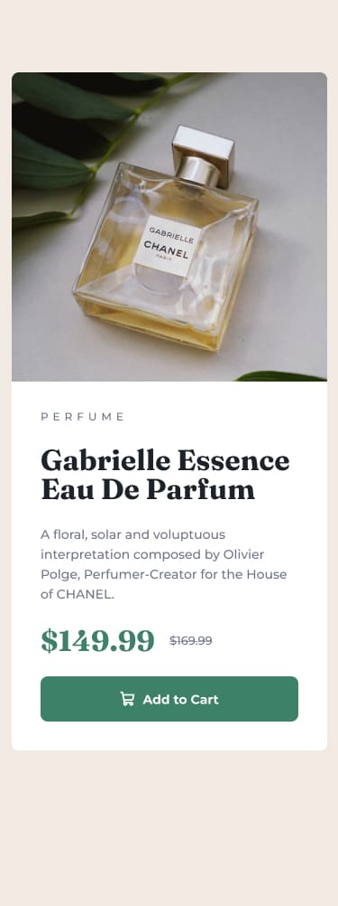
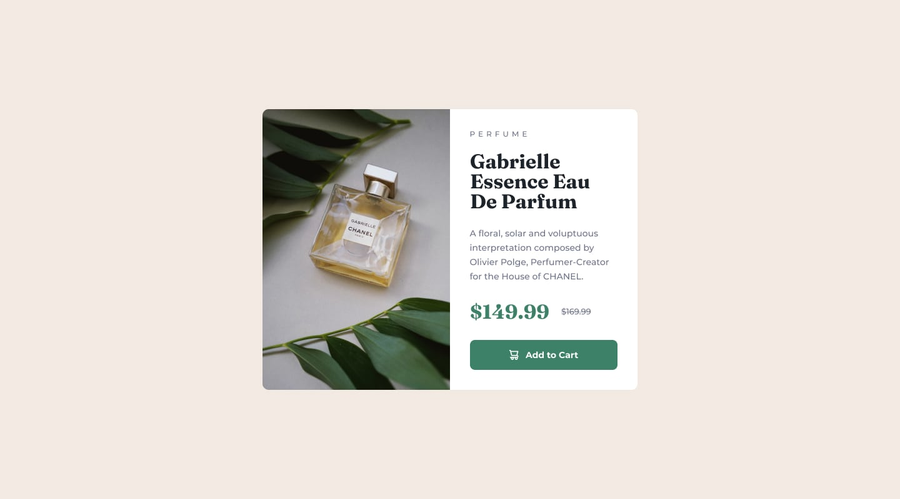

# Product Preview Card Component

A responsive product preview card built with semantic HTML and CSS, based on a [Frontend Mentor](https://www.frontendmentor.io) challenge. Built mobile-first using Flexbox.

---

## Screenshot

| Mobile                                     | Desktop                                      |
| ------------------------------------------ | -------------------------------------------- |
|  |  |

---

## Built With

- Semantic HTML5
- CSS Custom Properties
- Flexbox
- Mobile-first workflow
- Google Fonts — [Montserrat](https://fonts.google.com/specimen/Montserrat) & [Fraunces](https://fonts.google.com/specimen/Fraunces)

---

## Key Concepts

### CSS Custom Properties (Variables)

All design tokens are defined on `:root` so they can be reused and updated from a single source of truth.

```css
:root {
  --green-500: hsl(158, 36%, 37%);
  --ff-body: "Montserrat", sans-serif;
  --ff-h1: "Fraunces", serif;
  --fw-bold: 700;
  --fs-base: 0.875rem;
}
```

Using `var(--token-name)` throughout the stylesheet means changing a colour or font only ever requires editing one line.

---

### Mobile-First CSS

Base styles target mobile by default. The desktop layout is applied inside a `min-width` media query that only overrides what changes at that breakpoint — nothing more.

```css
/* Mobile base — column layout */
.product {
  display: flex;
  flex-direction: column;
}

/* Desktop override — row layout */
@media (min-width: 600px) {
  .product {
    flex-direction: row;
  }
}
```

This keeps the stylesheet lean and avoids undoing styles you've already written.

---

### Flexbox Layout

Flexbox handles both the page-level centering and the card's internal layout.

```css
/* Centre the card on the page */
main {
  height: 100vh;
  display: flex;
  justify-content: center;
  align-items: center;
}

/* Split card into equal halves on desktop */
.product-image,
.product-content {
  flex: 1;
}
```

`flex: 1` is shorthand for `flex-grow: 1` — it tells both halves to grow equally and share the available space.

---

### overflow: hidden

Applied to the card container to clip the image corners to match the card's `border-radius`. Without it the image would bleed outside the rounded corners.

```css
.product {
  border-radius: 0.5rem;
  overflow: hidden; /* clips children to the card's rounded corners */
}
```

---

### object-fit: cover

Prevents the image from stretching or distorting when it needs to fill a fixed area.

```css
.product-image img {
  height: 100%;
  object-fit: cover; /* crops to fill without distorting aspect ratio */
}
```

---

### CSS Inheritance

Rather than repeating `font-family`, `font-size`, and `color` on every child element, these are set once on the `.product-content` wrapper and inherited automatically. Only exceptions override the inherited value.

```css
.product-content {
  font-size: var(--fs-base);
  font-family: var(--ff-body);
  color: var(--grey);
}

/* Only the title needs overriding */
.product-title {
  font-family: var(--ff-h1);
  color: var(--black);
}
```

---

## HTML Concepts

### The `<del>` Element

The original price uses a `<del>` tag rather than just a styled `<p>`. This is semantic — `<del>` communicates to screen readers and search engines that the value is no longer valid, not just visually crossed out.

```html
<del class="product-original-price">$169.99</del>
```

CSS handles the visual strikethrough automatically because browsers apply `text-decoration: line-through` to `<del>` by default.

---

### The `<picture>` and `<source>` Elements

The `<picture>` element enables serving different images at different breakpoints — the browser picks the first `<source>` that matches and falls back to the `` if none do.

```html
<picture>
  <!-- Served at 600px and above -->
  <source
    media="(min-width: 600px)"
    srcset="assets/image-product-desktop.jpg"
  />
  <!-- Default fallback — always last, carries the mobile image -->
  
</picture>
```

**Key rules:**

- `<source>` tags are evaluated top to bottom — first match wins
- The `` must always be last — it is the fallback
- The `` carries the smallest/mobile image since it has no condition
- `<source>` is a void element — self-closing, no closing tag needed

This is purely HTML — no JavaScript or CSS required for the image swap.

---

### Decorative Icon `alt=""`

The cart icon inside the button is decorative because the button text already describes the action. An empty `alt` attribute tells screen readers to skip it entirely, avoiding redundant announcements.

```html
<button class="add-to-cart-btn">
  
  Add to Cart
</button>
```

---

## What I Learned

- Setting CSS variables on `:root` as a single source of truth for design tokens
- Mobile-first means writing base styles for small screens first, then using `min-width` media queries to add desktop styles
- `overflow: hidden` on a parent clips children to its `border-radius`
- `object-fit: cover` fills an area without stretching the image
- `<del>` is semantically correct for a struck-through original price
- `<picture>` with `<source>` handles responsive images in HTML without any JavaScript
- Setting `alt=""` on decorative icons improves screen reader experience

---

## Acknowledgements

Challenge by [Frontend Mentor](https://www.frontendmentor.io).
